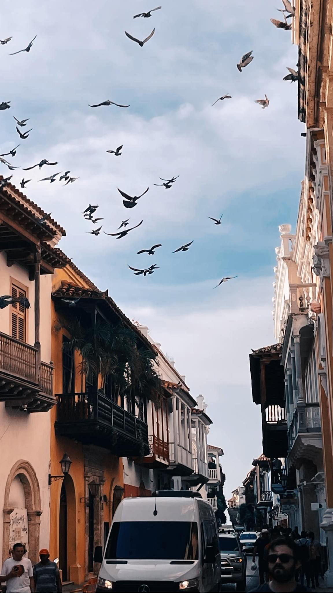
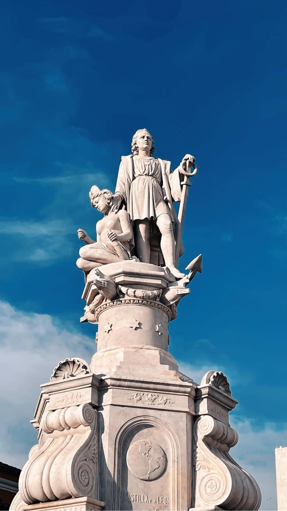

# Welcome to my website!
Hi My name is John but most of my friends call me <strong>JC</strong>. I am freshman attending Weber State University. My degree is in Computer Science but I also like to do art and travel. 
Here are couple of pictures from my recent trip to <em>Cartagena, Colombia!</em>  

* * *

* * *

## Hobbies
My hobbies involve collecting action figures and drawing. You can check them out at my instagram page!  
[JC's instagram](https://www.instagram.com/_crazyjc/) 
I love listening to music. Here is a link to my spotify playlist. 
[Spotify playlist](https://open.spotify.com/playlist/4CXUvJWg0ubdXC2MsaDM41?si=f83641d6938249a9)
## Goals

| Goal/habit        |   Notes     | tracker |
|:-------------|:------------------|:------|
| Exercise     | worked out chest, shoulders, and triceps | 10/20/2023  |
|Learning to code | learned how to use flexbox in html | 10/20/2023  |
| Eating Habits           | consumed at most 2,000 calories      | 10/20/2023   |

* * *